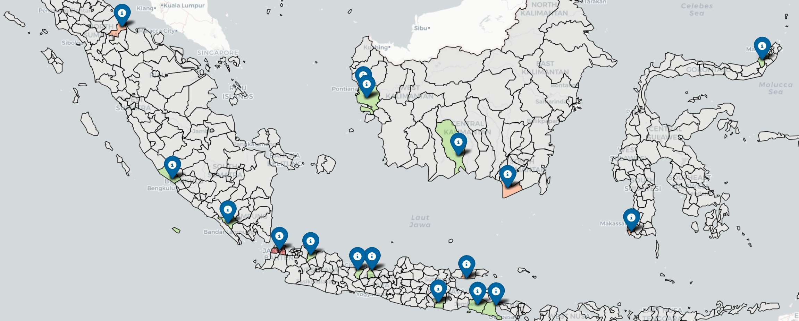

# ECC-NIN_MangroveChain_Kelompok_1_Batch_9

Repositori ini dibuat oleh Kelompok 1 untuk memenuhi soal ujian (Task 2) yang diberikan untuk menguasai sistem manajemen basis data relasional objek / PostgreSQL dan pemrograman Python dalam konteks MANGROVECHAIN CONSERVATION ANALYTICS. Dengan semangat inovasi dan kolaborasi, kami berupaya menghasilkan karya yang tidak hanya memenuhi standar, tetapi juga mencerminkan dedikasi kami untuk mendukung pembangunan sistem inovatif yang menggabungkan teknologi blockchain dengan upaya konservasi mangrove di seluruh Indonesia.

---
### 👥 Kelompok 1

| Nama             | No Absen      | Kelompok |
|------------------|---------------|----------|
| Anindya Avisa    | 9.004.DB2025  | 1        | 
| Retno K          | 9.007.DB2025  | 1        |  
| Maulana Yusuf    | 9.021.DB2025  | 1        |
| Denny Risnandar  | 9.030.DB2025  | 1        |
| Deka Isnadi      | 9.037.DB2025  | 1        |
| Doni Wahyudi     | 9.043.DB2025  | 1        |  
| ⁠Ayi Rahayu       | 9.046.DB2025  | 1        |    
| Raditya          | 9.056.DB2025  | 1        |  
| Ilfi Jandrisno   | 9.058.DB2025  | 1        |  


---
## 📜 BAB 1 PENDAHULUAN

### 1.1 Latar Belakang
Hutan mangrove merupakan salah satu ekosistem pesisir paling penting di dunia, terutama dalam mitigasi perubahan iklim melalui kemampuan tinggi menyerap karbon (blue carbon). Indonesia memiliki hutan mangrove terluas secara global, sekitar 3,7 juta hektare atau 23% dari total mangrove dunia. Ekosistem ini berperan besar dalam menahan abrasi, melindungi pesisir, mendukung keanekaragaman hayati, dan menjadi penyimpan karbon yang sangat efektif dengan potensi hingga 1.000 ton karbon per hektare.

Namun, keberadaan mangrove menghadapi ancaman serius. Sejak tahun 1980, sekitar 40% hutan mangrove Indonesia telah rusak akibat konversi lahan menjadi tambak, polusi limbah industri, dan tekanan aktivitas manusia seperti penebangan untuk kayu bakar. Di sisi lain, perubahan iklim, termasuk kenaikan permukaan laut, memperburuk kondisi ekosistem ini. Kurangnya kesadaran masyarakat dan keterbatasan pendanaan juga menjadi hambatan besar dalam upaya konservasi.

Sementara itu, pasar karbon global membuka peluang ekonomi melalui perdagangan kredit karbon, di mana setiap 1 kredit mewakili 1 ton CO₂ yang berhasil diserap. Hutan mangrove yang direhabilitasi dapat menghasilkan kredit karbon bernilai ekonomi tinggi, sehingga menjadi insentif bagi upaya konservasi. Namun, pengelolaan data dan transaksi kredit karbon menghadapi tantangan besar, seperti kurangnya transparansi, risiko manipulasi data, double counting, serta biaya validasi yang tinggi.

MangroveChain adalah sistem inovatif yang menggabungkan teknologi blockchain dengan upaya konservasi mangrove di seluruh Indonesia. Analisis ini menyediakan wawasan mendalam tentang 30 proyek konservasi dari Aceh hingga Papua, melacak kepatuhan regulasi, dampak biodiversitas, keterlibatan masyarakat, dan transaksi kredit karbon yang tercatat dalam ledger blockchain yang tidak dapat diubah
Sistem ini mengintegrasikan 14 dimensi data termasuk pemantauan lingkungan, catatan kepemilikan lahan, sumber pendanaan, dan transaksi smart contract untuk menciptakan pandangan komprehensif tentang efektivitas konservasi. Ada 5 analisis yang menjadi dasar latar belakang masalah, diantaranya :
1. **Analisis Efektivitas Regulasi & Dampak Biodiversitas** : Tim konservasi menemukan adanya perbedaan yang cukup besar dalam hasil pemantauan biodiversitas pada berbagai proyek konservasi. Sebagai contoh, di Kalimantan Timur, proyek yang telah mendapatkan izin resmi menunjukkan kerapatan pohon hingga 40% lebih tinggi dibandingkan proyek yang izinnya masih menunggu persetujuan. Namun, situasinya berbeda di Jawa, di mana kualitas air tetap buruk meskipun izin proyek sudah disetujui. Analisis ini bertujuan mengungkap pola sistemik bagaimana kerangka regulasi dan struktur kepemilikan lahan mempengaruhi hasil konservasi.Hal ini didorong oleh tingginya risiko penyelewengan dana, kurangnya transparansi, dan sulitnya mengukur dampak secara akurat dalam model pendanaan konvensional. Sebuah konsorsium investor hijau bahkan telah mengalokasikan dana sebesar 15 juta dolar AS untuk proyek konservasi mangrove. 
Penelitian ini difokuskan untuk menjawab beberapa pertanyaan penting, yaitu:

   - Apakah status izin proyek berpengaruh terhadap peningkatan biodiversitas, misalnya kualitas air dan kerapatan pohon?
     
   - Bagaimana perbedaan kepemilikan lahan (negara, swasta, masyarakat) memengaruhi keanekaragaman spesies?
     
   - Apakah proyek dengan batas lahan yang jelas secara hukum mampu mencapai hasil ekologi yang lebih baik?

3. **Optimalisasi Pendanaan Berbasis Blockchain.** Investor berdampak (impact investors) kini semakin menuntut bukti terverifikasi mengenai efektivitas program dalam mengurangi emisi karbon serta integritas data yang disajikan. Hal ini didorong oleh tingginya risiko penyelewengan dana, kurangnya transparansi, dan sulitnya mengukur dampak secara akurat dalam model pendanaan konvensional. Sebuah konsorsium investor hijau bahkan telah mengalokasikan dana sebesar 15 juta dolar AS untuk proyek konservasi mangrove. Namun, dana ini hanya akan disalurkan jika terdapat jaminan bahwa proyek tersebut memenuhi persyaratan ketat, antara lain :

   - Perlindungan data yang kuat melalui enkripsi blockchain.
     
   - Persetujuan masyarakat yang terdokumentasi
     
   - Bukti efisiensi penyerapan karbon
   
   Dengan demikian, dibutuhkan sebuah sistem analisis yang mampu mengoptimalkan pendanaan berbasis blockchain, dengan menekankan pada :

   - Kuantifikasi penyerapan karbon per unit investasi

   - Verifikasi tata kelola data yang sesuai standar

   - Pemilihan proyek dengan kinerja terbaik

   Optimalisasi ini bukan hanya akan meningkatkan kepercayaan investor, tetapi juga mendorong tercapainya target mitigasi perubahan iklim secara lebih transparan dan akuntabel.

3. **Prediksi Kinerja Proyek Berbasis Keterlibatan Masyarakat**. : Keberhasilan suatu proyek pembangunan tidak hanya bergantung pada ketersediaan sumber daya dan perencanaan teknis, tetapi juga pada tingkat keterlibatan masyarakat dalam proses pelaksanaannya. Studi empiris menunjukkan bahwa proyek yang memiliki partisipasi masyarakat tinggi cenderung lebih berkelanjutan dalam jangka panjang. Data historis memperlihatkan bahwa proyek dengan tingkat keterlibatan masyarakat di atas 30% memiliki peluang keberlanjutan hingga 75% lebih tinggi setelah tiga tahun dibandingkan proyek dengan partisipasi rendah. Adapun faktor analisisnya antara lain :

   - Seberapa sering masyarakat ikut kegiatan, Misalnya berapa kali ada lokakarya, konsultasi, atau pelatihan yang melibatkan masyarakat.
  
   - Bagaimana manfaat ekonomi dibagi ke warga lokal. Apakah keuntungan atau bantuan dari proyek benar-benar sampai ke masyarakat sekitar?

   - Tingkat keikutsertaan dibandingkan jumlah warga. Dari seluruh anggota komunitas, berapa banyak yang ikut berpartisipasi?

   - Hubungan waktu antara kegiatan dan peningkatan keanekaragaman hayati. Apakah setelah ada kegiatan tersebut, keanekaragaman hayati (biodiversitas) meningkat? Dan berapa lama jeda waktunya?
  
4. **Analisis Risiko Hukum Multi-Dimensi**. Pengelolaan proyek dengan kompleksitas tinggi sering kali menghadapi tantangan hukum yang dapat mempengaruhi keberlanjutan dan keberhasilan implementasi. Risiko hukum ini muncul dari berbagai faktor, diantaranya :

   - Perizinan yang tertunda, batas lahan yang tidak jelas.
  
   - kepemilikan lahan masyarakat adat yang sulit diverifikasi.
  
   - Kualitas lingkungan yang buruk serta kebutuhan restorasi yang intensif

   Berdasarkan studi kasus di Sulawesi Selatan, proyek yang mengandung ketiga faktor risiko tersebut memiliki kemungkinan 60% lebih tinggi untuk menghadapi konflik hukum dalam dua tahun mendatang. Hal ini menunjukkan pentingnya analisis risiko hukum yang bersifat multi-dimensi agar perusahaan maupun instansi terkait dapat mengantisipasi potensi permasalahan secara proaktif. Identifikasi yang tepat terhadap kombinasi faktor risiko ini menjadi kunci dalam menyusun strategi mitigasi yang efektif untuk menghindari sengketa dan memperlancar proses implementasi proyek.

   Adapun metodologi yang digunakan, yaitu :

   - Sistem scoring dengan bobot berbeda untuk setiap kriteria risiko. Artinya, setiap faktor risiko (misalnya izin, kepemilikan lahan, kualitas air) diberi nilai (skor) sesuai tingkat pengaruhnya. Faktor yang lebih penting diberi bobot lebih besar.

   - Klasifikasi proyek menjadi risiko rendah, sedang, tinggi. Setelah semua faktor dinilai, proyek dikelompokkan menjadi tiga kategori: risiko rendah, risiko sedang, atau risiko tinggi.

   - Analisis geospasial pola sebaran risiko. Ini berarti menggunakan peta dan data lokasi untuk melihat di mana proyek-proyek dengan risiko tertentu berada, sehingga bisa diketahui pola penyebarannya

5. **Analisis Jaringan Blockchain dalam Konservasi**. implementasi teknologi ini memerlukan pemahaman mendalam mengenai pola berbagi data dalam jaringan blockchain.  CTO (Chief Technology Officer) harus mampu menganalisis berbagai tipe data yang terlibat, seperti :

   - Distribusi tipe data (Geografis/Personal/Transaksi) per wilayah : Melihat sebaran berbagai jenis data di setiap wilayah. Misalnya, di satu wilayah lebih banyak data lokasi (geografis), sedangkan di wilayah lain lebih banyak data pribadi atau data transaksi.

   - Korelasi antara level akses dengan volume transaksi karbon : Melihat tingkat keterbukaan data (misalnya data terbuka untuk umum atau hanya untuk pihak tertentu) berpengaruh terhadap jumlah transaksi karbon yang terjadi. Contohnya, apakah jika data lebih terbuka, jumlah transaksi karbon jadi lebih banyak?

   - Pola temporal penerbitan izin vs aktivitas blockchain : Mempelajari bagaimana waktu penerbitan izin (misalnya izin konservasi) berkaitan dengan aktivitas di blockchain. Misalnya, apakah aktivitas blockchain meningkat setiap kali izin baru diterbitkan?

   Hasil analisis awal menunjukkan bahwa proyek dengan data geografis terbuka memiliki volume transaksi 2,5 kali lebih tinggi dibandingkan proyek yang datanya terbatas. Fakta ini menunjukkan pentingnya analisis jaringan blockchain untuk menentukan strategi distribusi data, pengelolaan izin, serta pengembangan arsitektur sistem yang efektif dan berkelanjutan dalam mendukung konservasi.

   Adapun aspek teknisnya antara lain :

   - Analisis jaringan hubungan antara node data : Mempelajari bagaimana titik-titik (node) dalam jaringan blockchain saling terhubung. Misalnya, siapa yang mengirim data, siapa yang menerima, dan bagaimana pola koneksinya.

   - Pola aliran informasi antar stakeholder : Melihat bagaimana informasi berpindah dari satu pihak ke pihak lain (misalnya dari pemerintah ke LSM atau dari perusahaan ke masyarakat). Ini penting agar komunikasi dan koordinasi berjalan lancar

   - Optimasi desain smart contract : Membuat aturan otomatis (smart contract) yang lebih efisien dan aman supaya transaksi berjalan cepat, transparan, dan tanpa kesalahan.
   
---
## 📜 BAB 2 PEMBAHASAN

### 2.1 Deskripsi
Tugas ini berfokus pada analisis konservasi mangrove di Indonesia dengan pendekatan integratif, menggabungkan aspek ekologi, teknologi blockchain, dan partisipasi masyarakat. Dataset yang digunakan mencakup:

  - **Ekologi Mangrove**: Data spesies (Rhizophora, Avicennia), zonasi habitat (proksimal, intermediet, distal), dan fungsi ekosistem (proteksi pesisir, penyerapan karbon).
  - **Teknologi Blockchain**: Tabel transaksi kredit karbon (Blockchain_Transactions.csv), validasi proyek (Conservation_Validators.csv), dan kepatuhan data (Blockchain_Data_Compliance.csv).
  - **Sosial-Ekonomi**: Keterlibatan masyarakat (Community_Engagement.csv), pendanaan (Funding_Sources.csv), dan manfaat ekowisata (contoh: Banten menghasilkan Rp500 juta/tahun).
  - **Regulasi**: Dokumen legal (Land_Tenure_Records.csv, Regulatory_Permits.csv) dan kebijakan (*Perpres No. 98/2021*, *Permen LHK No. P.33/2016*).

Studi kasus utama meliputi restorasi pasca-tsunami di Aceh, ekowisata di Banten, dan proyek berbasis blockchain di Kalimantan Barat, dengan indikator kinerja (KPI) seperti luas rehabilitasi, karbon terserap, dan partisipasi masyarakat.

---
### 2.2 Tujuan dan Ruang Lingkup
Tugas ini bertujuan untuk:

1. **Analisis Ekologi:**

  - Menilai adaptasi spesies mangrove terhadap zonasi salinitas dan dampaknya pada survival rate (contoh: Rhizophora mucronata di Aceh mencapai 85%).
  - Mengukur penyerapan karbon menggunakan formula C = A x D x F (luas area × kepadatan karbon × faktor konversi). 
​
2. **Implementasi Blockchain:**

  - Memverifikasi transparansi kredit karbon melalui Blockchain_Transactions.csv (contoh: 250 kredit dari proyek C001).
  - Mengevaluasi efisiensi sistem dengan formula persentase transaksi tervalidasi.

3. **Dampak Sosial-Ekonomi:**
   
  - Menganalisis distribusi manfaat ke masyarakat dan kontribusi mitra lokal (Local_Partners.csv).

4. **Kepatuhan Regulasi:**
   
  - Memetakan proyek sesuai regulasi seperti *Perpres No. 98/2021* untuk perdagangan kredit karbon dan *UU No. 41/1999* tentang larangan konversi lahan.

**Ruang Lingkup**:

  - Target Geografis: Wilayah kritis (Papua, Sumatra, Kalimantan) dengan prioritas rehabilitasi.
  - Metodologi: Pemantauan berbasis GIS/drone, validasi berkala, dan pelibatan masyarakat adat.
  - Output: Rekomendasi strategis untuk konservasi berbasis eco-techno (blockchain, IoT) dan peningkatan KPI seperti 90% kredit karbon tervalidasi.

Dokumen ini menjadi panduan bagi eco-techno leader dalam mengintegrasikan sains, teknologi, dan kebijakan untuk konservasi mangrove berkelanjutan.

---
## Studi Kasus #3 - Latar Belakang

CEO ingin mengembangkan **model prediktif** untuk mengalokasikan sumber daya secara optimal pada proyek konservasi mangrove. Data historis menunjukkan bahwa proyek dengan **partisipasi masyarakat di atas 30%** memiliki tingkat **keberlanjutan 75% lebih tinggi** setelah 3 tahun.

## Faktor yang Dianalisis

1. **Frekuensi Kegiatan Masyarakat** (Lokakarya / Konsultasi / Pelatihan)
2. **Distribusi Manfaat Ekonomi** kepada masyarakat lokal
3. **Tingkat Partisipasi Relatif** terhadap ukuran komunitas
4. **Korelasi Temporal** antara kegiatan dengan peningkatan biodiversitas

## Dataset yang Digunakan

- **014Community_Engagement**
- **004Community_Members**
- **001Mangrove_Conservation_Records**

## Query Normalisasi Partisipasi dan Biodiversitas

```sql
WITH partisipasi_normal AS (
    SELECT 
        ce.Conservation_ID, 
        ce.Participants::INTEGER / NULLIF((SELECT AVG(Participants::INTEGER) FROM "014Community_Engagement"), 0) AS partisipasi_relatif, 
        COUNT(*) OVER (PARTITION BY ce.Conservation_ID) AS frekuensi_kegiatan, 
        SUM(Benefit_Distributed::INTEGER) OVER (PARTITION BY ce.Conservation_ID) AS total_manfaat,
        ce.Engagement_Date
    FROM "014Community_Engagement" ce
),
biodiversitas_summary AS (
    SELECT
        mc.Conservation_ID,
        mc.Area_Ha,
        mc.Carbon_Credits,
        mc.Date_Recorded
    FROM "001Mangrove_Conservation_Records" mc
)
SELECT 
    pn.Conservation_ID,
    pn.partisipasi_relatif,
    pn.frekuensi_kegiatan,
    pn.total_manfaat,
    pn.Engagement_Date,
    bs.Area_Ha,
    bs.Carbon_Credits,
    bs.Date_Recorded AS biodiversity_record_date
FROM partisipasi_normal pn
LEFT JOIN biodiversitas_summary bs ON pn.Conservation_ID = bs.Conservation_ID
ORDER BY pn.Engagement_Date;
```

## Python Script: Time Series Forecasting dengan ARIMA

```python
import pandas as pd
import numpy as np
import matplotlib.pyplot as plt
from statsmodels.tsa.arima.model import ARIMA
from pandas.plotting import register_matplotlib_converters

register_matplotlib_converters()

# Simulasi Data Engagement (Date & Partisipasi Relatif)
dates = pd.date_range(start='2024-01-01', periods=20, freq='MS')
partisipasi_relatif = np.random.uniform(0.7, 1.4, 20)

# Membuat DataFrame
df_time_series = pd.DataFrame({
    'engagement_date': dates,
    'partisipasi_relatif': partisipasi_relatif
})
df_time_series.set_index('engagement_date', inplace=True)
df_time_series = df_time_series.asfreq('MS')  # Menetapkan frekuensi eksplisit

# Fit Model ARIMA (order p,d,q = 1,1,1)
model = ARIMA(df_time_series['partisipasi_relatif'], order=(1,1,1))
model_fit = model.fit()

# Forecast 6 Bulan Kedepan
forecast = model_fit.forecast(steps=6)
forecast_dates = pd.date_range(start=dates[-1] + pd.DateOffset(months=1), periods=6, freq='MS')

# Visualisasi Hasil Forecast
plt.figure(figsize=(12,6))
plt.plot(df_time_series.index, df_time_series['partisipasi_relatif'], label='Actual Partisipasi')
plt.plot(forecast_dates, forecast, label='Forecasted Partisipasi', linestyle='--', color='red')
plt.title('ARIMA Time Series Forecasting: Partisipasi Relatif')
plt.xlabel('Date')
plt.ylabel('Partisipasi Relatif')
plt.legend()
plt.grid(True)
plt.show()

# Output Forecast
forecast_df = pd.DataFrame({
    'Forecast_Date': forecast_dates,
    'Forecasted_Partisipasi': forecast.values
})
print(forecast_df)
```

## Output yang Dihasilkan

1. **Grafik Time Series**:
   - Menampilkan tren aktual dan prediksi Partisipasi Relatif 6 bulan ke depan.
2. **Tabel Forecast**:
   - Daftar nilai forecasted_partisipasi dari hasil ARIMA.

## Manfaat Analisis Ini

- Membantu manajemen dalam mengalokasikan sumber daya secara lebih akurat.
- Mengidentifikasi pola keterlibatan masyarakat yang menjadi indikator keberlanjutan proyek.
- Memantau efektivitas program community engagement selama fase awal proyek.

---

**Catatan:** Dataset produksi akan diambil dari integrasi tabel **014Community_Engagement**, **004Community_Members**, dan **001Mangrove_Conservation_Records** sesuai skenario aktual.

---

## Studi Kasus 4
### 🌿 Analisis Risiko Konflik Hukum – Proyek Mangrove Indonesia

Repository ini berisi proses analisis dan visualisasi untuk menilai tingkat risiko konflik hukum pada 20 proyek konservasi mangrove di Indonesia.  
Departemen Hukum perlu mengidetifikasi berdasarkan studi kasus Sulawesi Selatan yang menunjukkan **peningkatan 60 % risiko konflik** jika proyek memenuhi ketiga faktor risiko berikut:

| Faktor Resiko | Kriteria | Bobot |
|--------|----------|-------|
| **Izin & Batas Lahan**            | permit_status = 'Pending' **dan** boundary_defined = 'No' | 30 |
| **Lahan Masyarakat & Akses Data** | land_type = 'Community Land' **dan** access_level = 'Restricted' | 40 |
| **Kualitas Air & Restorasi**      | water_quality = 'Poor' **dan** activity_type = 'Restoration' | 30 |

---

### 📊 Skor & Tingkat Risiko

| Total Skor | Tingkat Risiko |
|------------|----------------|
| ≥ 70       | 🔴 **High** |
| 30 – 69    | 🟡 **Medium** |
| < 30       | 🟢 **Low** |

---

### 🚀 Cara Pakai

1. Pastikan seluruh CSV sudah di-load ke tabel sesuai skema.
2. Jalankan query di file `StudiKasus4.sql` atau blok berikut:

```sql
WITH CTE_Skor AS (
    SELECT
        A.conservation_id,
        A.location,
        CASE
            WHEN B.permit_status = 'Pending' AND C.boundary_defined = 'No' THEN 30
            ELSE 0
        END AS skor_izin,
        CASE
            WHEN C.land_type = 'Community Land' AND D.access_level = 'Restricted' THEN 40
            ELSE 0
        END AS skor_masyarakat,
        CASE
            WHEN E.water_quality = 'Poor' AND F.activity_type = 'Restoration' THEN 30
            ELSE 0
        END AS skor_air
    FROM mangrove_conservation_records A
    JOIN regulatory_permits B ON A.conservation_id = B.conservation_id
    JOIN land_tenure_records C ON A.conservation_id = C.conservation_id
    JOIN blockchain_data_compliance D ON A.conservation_id = D.conservation_id
    JOIN biodiversity_monitoring E ON A.conservation_id = E.conservation_id
    JOIN conservation_activities F ON A.conservation_id = F.conservation_id
)

SELECT
    A.conservation_id,
    A.location,
    (A.skor_izin + A.skor_masyarakat + A.skor_air) AS total_skor,
    CASE
        WHEN (A.skor_izin + A.skor_masyarakat + A.skor_air) >= 70 THEN 'High'
        WHEN (A.skor_izin + A.skor_masyarakat + A.skor_air) >= 30 THEN 'Medium'
        ELSE 'Low'
    END AS tingkat_risiko,
    B.Latitude  AS lat,
    B.Longitude AS lon
FROM CTE_Skor A
JOIN koordinat_kabupaten B ON A.location = B.location
ORDER BY total_skor DESC;
```
3. Hasil query dapat langsung diekspor ke CSV atau diimpor ke dashboard GIS.

### 📈 Contoh Output Table

| conservation_id | location |	total_skor | tingkat_risiko | lat | lon |
|-----------------|----------|-------------|----------------|-----|-----|
|C003   |	Tanah Laut  |	100 |	High    |	-3.45   |	114.8   |
|C015   |	Sampang     |	30  |   Medium  |	-7.20   |	113.5   |
|C001   |	Aceh Jaya   |	0	|   Low     |	4.60    |	95.80   |

---

### 📁 Dataset

| Dataset | Deskripsi |
|--------|-----------|
| `assets/Result_StudiKasus4.csv` | Data risiko per lokasi (kabupaten), termasuk koordinat, skor, dan tingkat risiko |
| GeoJSON Kabupaten | Diambil dari GitHub publik: batas administratif kabupaten di seluruh Indonesia |

### 🧰 Library yang Digunakan

```python
import pandas as pd
import folium
from sqlalchemy import create_engine
from urllib.parse import quote_plus
from branca.element import MacroElement
from jinja2 import Template
import geopandas as gpd
```

### 🧪 Langkah-langkah Analisis
1. Load Data Risiko Proyek
```python
df_risiko = pd.read_csv("assets/Result_StudiKasus4.csv")
```
2. Load GeoJSON Kabupaten
```python
url_kab = "https://raw.githubusercontent.com/ardian28/GeoJson-Indonesia-38-Provinsi/486e89ca57c9f9910991dbf00afca26297b3baa3/Kabupaten/38%20Provinsi%20Indonesia%20-%20Kabupaten.json"
kab_geo = gpd.read_file(url_kab).to_crs(4326)
```

3. Filter Kabupaten Valid
```python
kab_geo = kab_geo[
    kab_geo["WADMKK"].notnull() & 
    kab_geo["WADMPR"].notnull() & 
    kab_geo["geometry"].notnull()
]
```
4. Normalisasi Nama Kabupaten
```python
manual_map = {
    "Sampit": "Kotawaringin Timur",
    "Labuhan Batu": "Labuhanbatu"
}

def normalisasi_nama(nama):
    nama = nama.lower().replace("kota ", "").replace("kabupaten ", "").replace("kab. ", "").strip()
    nama = manual_map.get(nama.title(), nama.title())
    return nama

df_risiko["location_norm"] = df_risiko["location"].apply(normalisasi_nama)
kab_geo["WADMKK_norm"] = kab_geo["WADMKK"].apply(normalisasi_nama)
```

Proses dilakukan untuk penyesuaian nama dari output CSV dengan data yang ada pada GeoJSON

5. Buat Dictionary Risiko per Kabupaten
```python
risiko_dict = df_risiko.set_index("location_norm")["tingkat_risiko"].to_dict()
```
6. Inisialisasi Peta Dasar
```python
m = folium.Map(
    location=[df_risiko["lat"].mean(), df_risiko["lon"].mean()],
    zoom_start=5,
    tiles="CartoDB positron"
)
```
7. Atur Warna Berdasarkan Risiko
```python
warna = {"High": "#d73027", "Medium": "#fc8d59", "Low": "#91cf60"}
```

8. Fungsi Styling GeoJSON
```python
def style_fn(feature):
    props = feature["properties"]
    kabupaten_norm = props.get("WADMKK_norm", "").strip()
    if kabupaten_norm in risiko_dict:
        level = risiko_dict[kabupaten_norm]
        fill = warna.get(level, "gray")
    else:
        fill = "lightgray"
    return {
        "fillColor": fill,
        "color": "black",
        "weight": 1,
        "fillOpacity": 0.5
    }
```
9. Menambahkan Layer GeoJSON
```python
folium.GeoJson(
    kab_geo,
    name="Batas Kabupaten",
    style_function=style_fn,
    tooltip=folium.GeoJsonTooltip(
        fields=["WADMKK", "WADMPR"],
        aliases=["Kabupaten:", "Provinsi:"],
        sticky=True
    )
).add_to(m)
```
10. Tambahkan Marker Lokasi Proyek
```python
for _, r in df_risiko.iterrows():
    if pd.notnull(r["lat"]) and pd.notnull(r["lon"]):
        folium.Marker(
            location=[r["lat"], r["lon"]],
            tooltip=(f"<b>{r['location']}</b><br>Skor: {r['total_skor']}<br>Risiko: {r['tingkat_risiko']}"),
            icon=folium.Icon(color="darkblue", icon="info-sign")
        ).add_to(m)
```

### 🌐 Output Akhir
- 🗺️ Peta interaktif wilayah Indonesia
- 🎯 Kabupaten diwarnai sesuai risiko:
🔹🔴 High → Merah
🔹🟠 Medium → Oranye
🔹🟢 Low → Hijau
🔹⚪ Tidak ditemukan → Abu-abu terang
- 📌 Marker berisi detail proyek berdasarkan skor dan lokasi

### 📝 Catatan
🔹Pastikan koneksi internet aktif untuk mengakses GeoJSON dari GitHub.
🔹Jika ada kabupaten yang tidak muncul warnanya, pastikan namanya dicocokkan di fungsi normalisasi_nama() atau tambahkan ke manual_map.
🔹Jika dijalankan di luar Jupyter Notebook, render peta dapat disimpan menggunakan:
```python
m.save("output_peta_resiko.html")
```

### 📷 Contoh Visualiasasi



### 📂 Struktur File
```
.
├── assets/
│   └── Result_StudiKasus4.csv
├── img
│   └── peta-resiko.png
├── StudiKasus4.ipynb
└── README.md
```

### 📌 Referensi

- [GeoJSON Kabupaten dari Ardian28](https://github.com/ardian28/GeoJson-Indonesia-38-Provinsi)
- Dokumentasi: [Folium Documentation](https://python-visualization.github.io/folium/), [GeoPandas Documentation](https://geopandas.org/)
