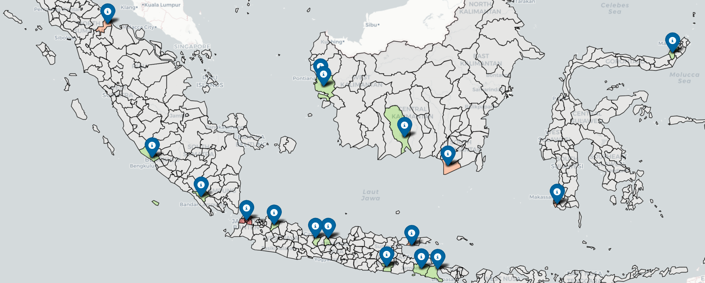

# ECC-NIN_MangroveChain_IlfiJandrisno_Batch9

# Studi Kasus 4
## 🌿 Analisis Risiko Konflik Hukum – Proyek Mangrove Indonesia

Repository ini berisi proses analisis dan visualisasi untuk menilai tingkat risiko konflik hukum pada 20 proyek konservasi mangrove di Indonesia.  
Departemen Hukum perlu mengidetifikasi berdasarkan studi kasus Sulawesi Selatan yang menunjukkan **peningkatan 60 % risiko konflik** jika proyek memenuhi ketiga faktor risiko berikut:

| Faktor Resiko | Kriteria | Bobot |
|--------|----------|-------|
| **Izin & Batas Lahan**            | permit_status = 'Pending' **dan** boundary_defined = 'No' | 30 |
| **Lahan Masyarakat & Akses Data** | land_type = 'Community Land' **dan** access_level = 'Restricted' | 40 |
| **Kualitas Air & Restorasi**      | water_quality = 'Poor' **dan** activity_type = 'Restoration' | 30 |

---

### 📊 Skor & Tingkat Risiko

| Total Skor | Tingkat Risiko |
|------------|----------------|
| ≥ 70       | 🔴 **High** |
| 30 – 69    | 🟡 **Medium** |
| < 30       | 🟢 **Low** |

---

### 🚀 Cara Pakai

1. Pastikan seluruh CSV sudah di-load ke tabel sesuai skema.
2. Jalankan query di file `StudiKasus4.sql` atau blok berikut:

```sql
WITH CTE_Skor AS (
    SELECT
        A.conservation_id,
        A.location,
        CASE
            WHEN B.permit_status = 'Pending' AND C.boundary_defined = 'No' THEN 30
            ELSE 0
        END AS skor_izin,
        CASE
            WHEN C.land_type = 'Community Land' AND D.access_level = 'Restricted' THEN 40
            ELSE 0
        END AS skor_masyarakat,
        CASE
            WHEN E.water_quality = 'Poor' AND F.activity_type = 'Restoration' THEN 30
            ELSE 0
        END AS skor_air
    FROM mangrove_conservation_records A
    JOIN regulatory_permits B ON A.conservation_id = B.conservation_id
    JOIN land_tenure_records C ON A.conservation_id = C.conservation_id
    JOIN blockchain_data_compliance D ON A.conservation_id = D.conservation_id
    JOIN biodiversity_monitoring E ON A.conservation_id = E.conservation_id
    JOIN conservation_activities F ON A.conservation_id = F.conservation_id
)

SELECT
    A.conservation_id,
    A.location,
    (A.skor_izin + A.skor_masyarakat + A.skor_air) AS total_skor,
    CASE
    	WHEN (A.skor_izin + A.skor_masyarakat + A.skor_air) >= 70 THEN 'High'
    	WHEN (A.skor_izin + A.skor_masyarakat + A.skor_air) >= 30 THEN 'Medium'
    	ELSE 'Low'
	END AS tingkat_risiko,
    B.Latitude  AS lat,
    B.Longitude AS lon
FROM CTE_Skor A
JOIN koordinat_kabupaten B ON A.location = B.location
ORDER BY total_skor DESC;
```
3. Hasil query dapat langsung diekspor ke CSV atau diimpor ke dashboard GIS.

### 📈 Contoh Output Table

| conservation_id | location |	total_skor | tingkat_risiko | lat | lon |
|-----------------|----------|-------------|----------------|-----|-----|
|C003   |	Tanah Laut  |	100 |	High    |	-3.45   |	114.8   |
|C015   |	Sampang     |	30  |   Medium  |	-7.20   |	113.5   |
|C001   |	Aceh Jaya   |	0	|   Low     |	4.60    |	95.80   |

---

### 📁 Dataset

| Dataset | Deskripsi |
|--------|-----------|
| `assets/Result_StudiKasus4.csv` | Data risiko per lokasi (kabupaten), termasuk koordinat, skor, dan tingkat risiko |
| GeoJSON Kabupaten | Diambil dari GitHub publik: batas administratif kabupaten di seluruh Indonesia |

### 🧰 Library yang Digunakan

```python
import pandas as pd
import folium
from sqlalchemy import create_engine
from urllib.parse import quote_plus
from branca.element import MacroElement
from jinja2 import Template
import geopandas as gpd
```

### 🧪 Langkah-langkah Analisis
1. Load Data Risiko Proyek
```python
df_risiko = pd.read_csv("assets/Result_StudiKasus4.csv")
```
2. Load GeoJSON Kabupaten
```python
url_kab = "https://raw.githubusercontent.com/ardian28/GeoJson-Indonesia-38-Provinsi/486e89ca57c9f9910991dbf00afca26297b3baa3/Kabupaten/38%20Provinsi%20Indonesia%20-%20Kabupaten.json"
kab_geo = gpd.read_file(url_kab).to_crs(4326)
```

3. Filter Kabupaten Valid
```python
kab_geo = kab_geo[
    kab_geo["WADMKK"].notnull() & 
    kab_geo["WADMPR"].notnull() & 
    kab_geo["geometry"].notnull()
]
```
4. Normalisasi Nama Kabupaten
```python
manual_map = {
    "Sampit": "Kotawaringin Timur",
    "Labuhan Batu": "Labuhanbatu"
}

def normalisasi_nama(nama):
    nama = nama.lower().replace("kota ", "").replace("kabupaten ", "").replace("kab. ", "").strip()
    nama = manual_map.get(nama.title(), nama.title())
    return nama

df_risiko["location_norm"] = df_risiko["location"].apply(normalisasi_nama)
kab_geo["WADMKK_norm"] = kab_geo["WADMKK"].apply(normalisasi_nama)
```

Proses dilakukan untuk penyesuaian nama dari output CSV dengan data yang ada pada GeoJSON

5. Buat Dictionary Risiko per Kabupaten
```python
risiko_dict = df_risiko.set_index("location_norm")["tingkat_risiko"].to_dict()
```
6. Inisialisasi Peta Dasar
```python
m = folium.Map(
    location=[df_risiko["lat"].mean(), df_risiko["lon"].mean()],
    zoom_start=5,
    tiles="CartoDB positron"
)
```
7. Atur Warna Berdasarkan Risiko
```python
warna = {"High": "#d73027", "Medium": "#fc8d59", "Low": "#91cf60"}
```

8. Fungsi Styling GeoJSON
```python
def style_fn(feature):
    props = feature["properties"]
    kabupaten_norm = props.get("WADMKK_norm", "").strip()
    if kabupaten_norm in risiko_dict:
        level = risiko_dict[kabupaten_norm]
        fill = warna.get(level, "gray")
    else:
        fill = "lightgray"
    return {
        "fillColor": fill,
        "color": "black",
        "weight": 1,
        "fillOpacity": 0.5
    }
```
9. Menambahkan Layer GeoJSON
```python
folium.GeoJson(
    kab_geo,
    name="Batas Kabupaten",
    style_function=style_fn,
    tooltip=folium.GeoJsonTooltip(
        fields=["WADMKK", "WADMPR"],
        aliases=["Kabupaten:", "Provinsi:"],
        sticky=True
    )
).add_to(m)
```
10. Tambahkan Marker Lokasi Proyek
```python
for _, r in df_risiko.iterrows():
    if pd.notnull(r["lat"]) and pd.notnull(r["lon"]):
        folium.Marker(
            location=[r["lat"], r["lon"]],
            tooltip=(f"<b>{r['location']}</b><br>Skor: {r['total_skor']}<br>Risiko: {r['tingkat_risiko']}"),
            icon=folium.Icon(color="darkblue", icon="info-sign")
        ).add_to(m)
```

### 🌐 Output Akhir
- 🗺️ Peta interaktif wilayah Indonesia
- 🎯 Kabupaten diwarnai sesuai risiko:
🔹🔴 High → Merah
🔹🟠 Medium → Oranye
🔹🟢 Low → Hijau
🔹⚪ Tidak ditemukan → Abu-abu terang
- 📌 Marker berisi detail proyek berdasarkan skor dan lokasi

### 📝 Catatan
🔹Pastikan koneksi internet aktif untuk mengakses GeoJSON dari GitHub.
🔹Jika ada kabupaten yang tidak muncul warnanya, pastikan namanya dicocokkan di fungsi normalisasi_nama() atau tambahkan ke manual_map.
🔹Jika dijalankan di luar Jupyter Notebook, render peta dapat disimpan menggunakan:
```python
m.save("output_peta_resiko.html")
```

### 📷 Contoh Visualiasasi



### 📂 Struktur File
```
.
├── assets/
│   └── Result_StudiKasus4.csv
├── img
│   └── peta-resiko.png
├── StudiKasus4.ipynb
└── README.md
```

### 📌 Referensi

- [GeoJSON Kabupaten dari Ardian28](https://github.com/ardian28/GeoJson-Indonesia-38-Provinsi)
- Dokumentasi: [Folium Documentation](https://python-visualization.github.io/folium/), [GeoPandas Documentation](https://geopandas.org/)
